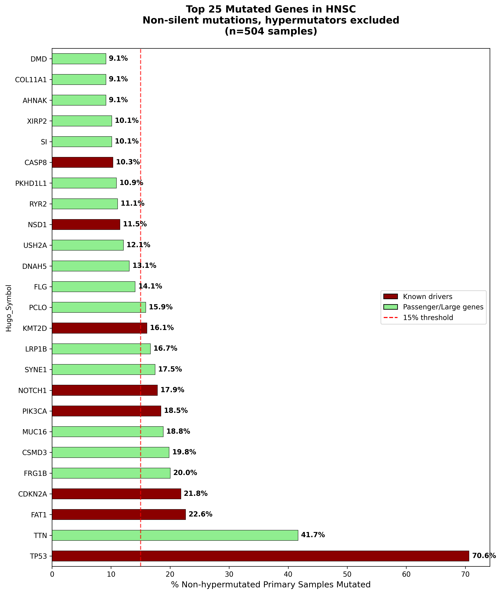
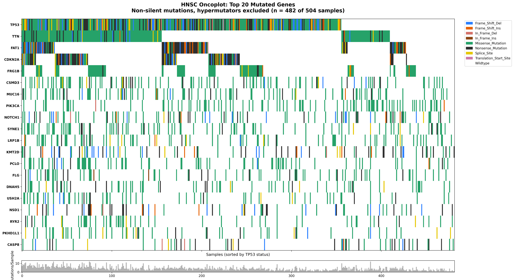
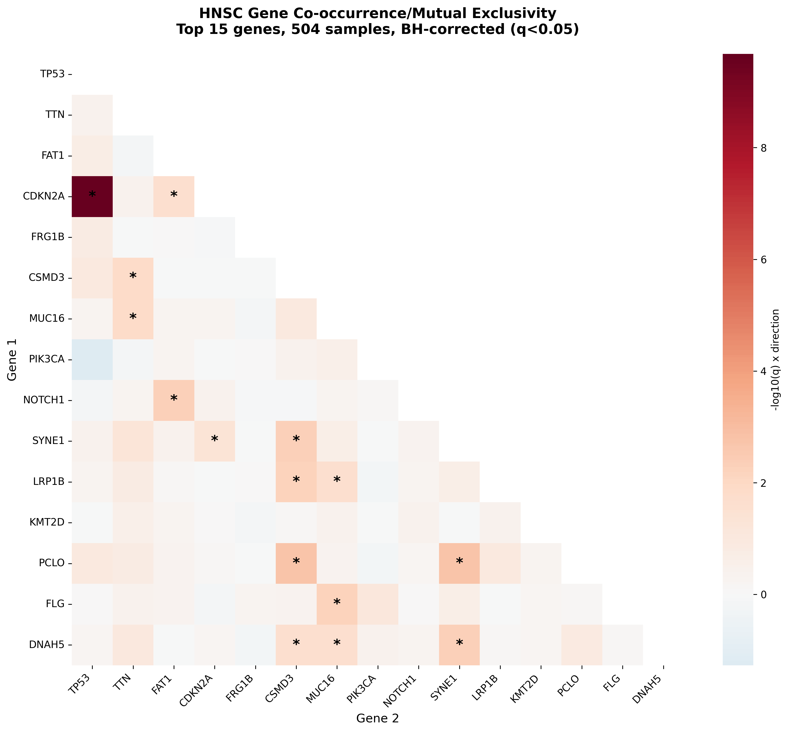
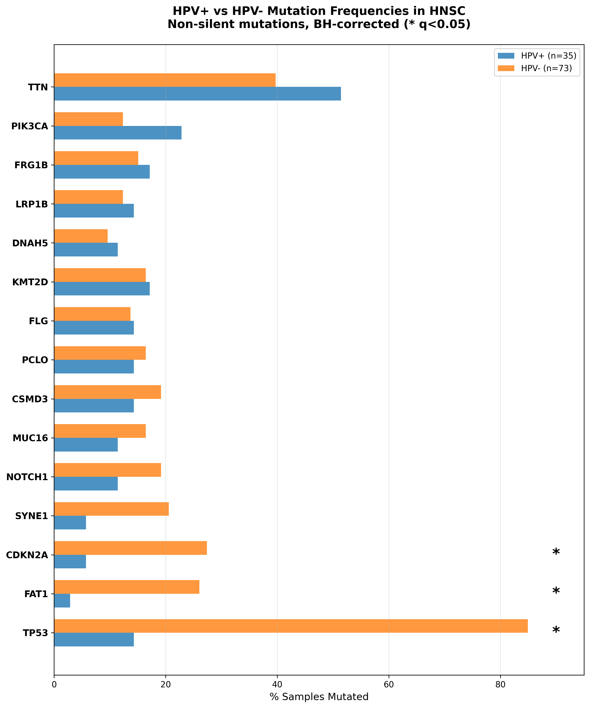

# Mutation Landscape of Head and Neck Squamous Cell Carcinoma

An independent analysis of somatic mutations in 504 TCGA head and neck cancer samples. The project identifies the most frequently mutated genes, tests whether mutations in different genes tend to appear together in the same tumors, and compares mutation patterns between HPV-positive and HPV-negative cancers.

Built entirely in Python.

---

## Figures

### 1. Most Frequently Mutated Genes



TP53 is mutated in 71% of samples. Eight known cancer-driving genes appear in the top 25 (dark red bars). The remaining genes (light blue) are large genes that accumulate mutations by chance due to their size, not because they drive cancer growth. TTN, for example, is the largest protein-coding gene in the human genome.

### 2. Mutation Types Across Samples (Oncoplot)



Each column is a patient. Each row is a gene. Colors indicate mutation type. Samples are sorted by TP53 status (mutated on the left, unmutated on the right).

TP53 shows a mix of mutation types (green, black, yellow, blue) — the gene is being broken in many different ways, which is not uncommon in tumor suppressors. TTN is almost entirely green (missense) — random hits in a large target. FAT1 is heavy with black (nonsense) and blue (frameshift) — the gene is being destroyed, not subtly altered.

### 3. Gene Co-occurrence



Tests whether mutations in two genes appear in the same tumors more often than expected (co-occurrence) or less often (mutual exclusivity). Red cells indicate co-occurrence. Asterisks mark statistically significant pairs after correcting for multiple testing.

The strongest signal: TP53 and CDKN2A mutations appear together far more than expected (odds ratio 12.0). This makes sense — they disable different pathways (p53 signaling and Rb signaling) through what appears to be the same gene family. Most other significant pairs are between large genes, likely reflecting shared mutation burden rather than biology.

### 4. HPV-Positive vs HPV-Negative



HPV-positive and HPV-negative head and neck cancers are different diseases at the molecular level. Three genes are significantly less mutated in HPV-positive tumors (asterisks):

- **TP53** (14% vs 85%) — HPV's E6 protein destroys p53 directly, so there is no need to mutate the gene
- **FAT1** (3% vs 26%) — characteristic of the smoking-driven, HPV-negative subtype
- **CDKN2A** (6% vs 27%) — HPV's E7 protein disables the Rb protein, making CDKN2A loss unnecessary

PIK3CA trends in the opposite direction (23% in HPV+ vs 12% in HPV-) but the difference is not statistically significant with only 35 HPV-positive samples.

---

## Reproduce This Analysis

### Requirements

- Python 3.10+
- [uv](https://github.com/astral-sh/uv) for dependency management
- ~500MB disk space for the raw data

### Steps

```bash
# Clone
git clone https://github.com/Bjorn99/hnsc-mutation-landscape.git
cd hnsc-mutation-landscape

# Install dependencies
uv sync

# Download data from cBioPortal
# Go to https://www.cbioportal.org/study/summary?id=hnsc_tcga
# Download the full dataset and extract into data/hnsc_tcga/

# Run the pipeline
cd scripts
uv run python 02_clean_data.py        # Clean and filter raw data
uv run python 03_mutation_frequency.py # Figure 1: mutation frequencies
uv run python 04_oncoplot.py           # Figure 2: oncoplot
uv run python 05_cooccurrence.py       # Figure 3: co-occurrence heatmap
uv run python 06_hpv_comparison.py     # Figure 4: HPV comparison

# 01_load_data.py is an exploratory script (not required for the pipeline)

```

All figures are saved to `figures/`. The cleaning script generates intermediate files in `data/` that the analysis scripts read.

---

## Repository Structure

```
hnsc-mutation-landscape/
├── scripts/
│   ├── 01_load_data.py           # Load and inspect raw files
│   ├── 02_clean_data.py          # Filter mutations, merge clinical data
│   ├── 03_mutation_frequency.py  # Figure 1
│   ├── 04_oncoplot.py            # Figure 2
│   ├── 05_cooccurrence.py        # Figure 3
│   └── 06_hpv_comparison.py      # Figure 4
├── notebooks/
│   ├── exploration.ipynb         # Data exploration
│   ├── oncoplot_dev.ipynb        # Oncoplot development
│   ├── cooccurrence_dev.ipynb    # Co-occurrence development
│   └── hpv_dev.ipynb             # HPV analysis development
├── figures/                      # All output figures
├── results/
│   └── summary.md                # Detailed results with citations
├── data/                         # Raw + cleaned data (gitignored)
├── pyproject.toml                # Python dependencies
├── uv.lock                       # Locked dependency versions
└── LICENSE                       # MIT
```

---

## Data Source

**Dataset:** Head and Neck Squamous Cell Carcinoma (TCGA, Firehose Legacy)
**Source:** [cBioPortal](https://www.cbioportal.org/study/summary?id=hnsc_tcga)
**Samples:** 528 patients, 530 samples (528 primary tumors used)
**Reference genome:** GRCh37/hg19

The TCGA-HNSC dataset is publicly available. No login or data access agreement is required.

---

## Methods at a Glance

- **Mutation filtering:** Silent and non-coding variants removed. 120,402 raw calls → 84,690 non-silent coding mutations.
- **Hypermutator exclusion:** 6 samples with mutation counts exceeding 3 standard deviations above the mean were flagged and excluded from analyses.
- **HPV classification:** p16 immunohistochemistry (HPV_STATUS_P16 column). 115 patients evaluable (41 positive, 74 negative). HPV-positive cases concentrated in oropharyngeal sites (78% in tonsil or base of tongue), consistent with known biology.
- **Statistical tests:** Fisher's exact test for all comparisons. Benjamini-Hochberg correction for multiple testing (FDR < 0.05).
- **No gene-length correction** was applied to mutation frequencies. Large genes (TTN, CSMD3, MUC16) are flagged as likely passengers in the interpretation but not removed from the analysis.

Full interpretation and limitations are in [`results/summary.md`](results/summary.md).

---

## What I Learned

This was my first independent computational biology project — built from publicly available cancer data. Some things that surprised me or changed how I think:

- **TP53 and CDKN2A co-occur, not exclude each other.** I initially thought there would be mutual exclusivity because both regulate cell cycle checkpoints. The data showed strong co-occurrence (OR=12.0). The resolution: CDKN2A encodes two proteins from alternative reading frames that control different pathways.

- **Two-thirds of the top 25 mutated genes are probably noise.** Only 8 of 25 are established cancer drivers. The rest are large genes catching random mutations. Without knowing this, a raw frequency table would be misleading.

- **Missing data.** cBioPortal encodes missing values as the string `[Not Available]` instead of null. Pandas counts these as valid data. A column that appears 100% complete might actually be 78% missing. I caught this and it informed every downstream decision.

- **Small sample sizes hide real biology.** PIK3CA enrichment in HPV-positive tumors is one of the most replicated findings in head and neck cancer. My analysis couldn't detect it with 35 HPV-positive samples. "Not significant" doesn't mean "Not real".

---

## License

MIT — see [LICENSE](LICENSE).
